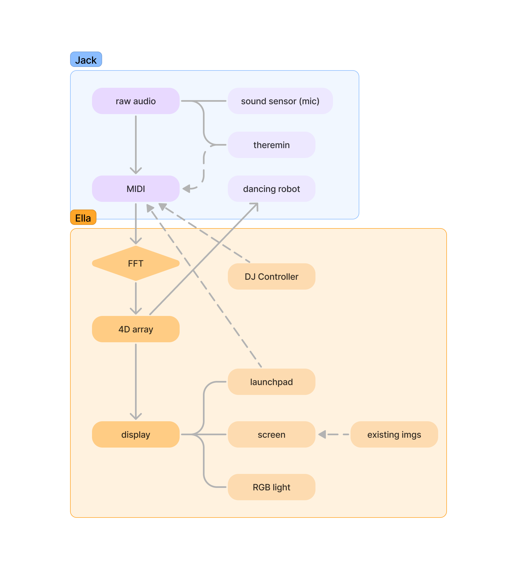

# microbeat

## Structure

## Usage
- **Accessibility -** Make music accessible to people with low musicality or hearing loss
- Present music visually breaking down to different dimensions, helpful for:
	- **Comparative Analysis -** comparing music genres (subgenres), historical periods, instruments, and performances visually
	- **Music History Timeline -** interactive timeline to explore the development of music over time, aiding in studying music history.
	- **Cross-Art Connections -** creating connections among different art styles (Ella's both photographer and DJ)
- Well U need to party before & after or even during studying XD

## What we learnt
- C++
- how to flash from ARM chip mac to arduino

## Known issues/ concerns
- passing 4D array (channel, duration, volume, pitch) might introduce competing issue

## Special thx to
- Suppliers to hardwares (RGB light, arduino, sound sensors) tha may or may not be present

