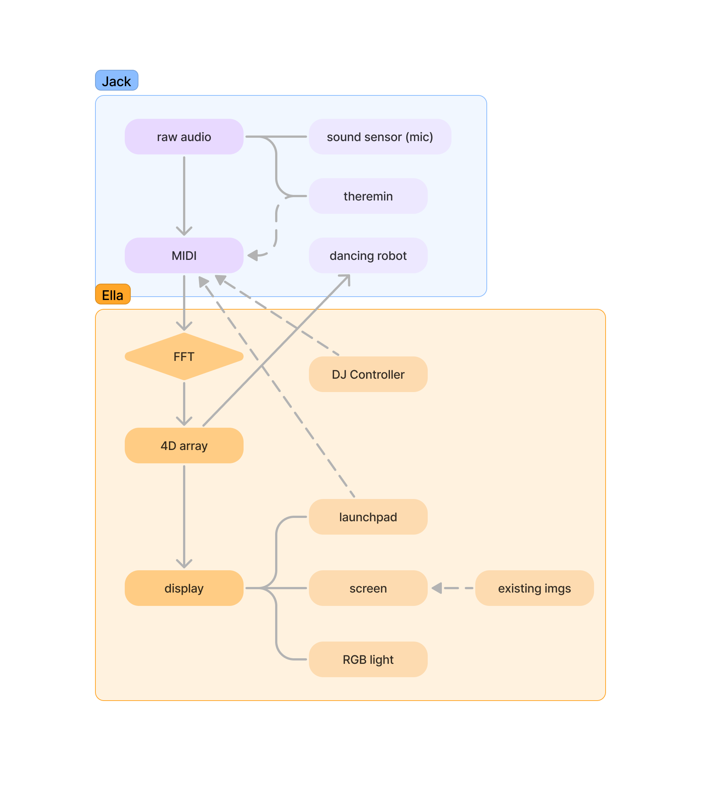
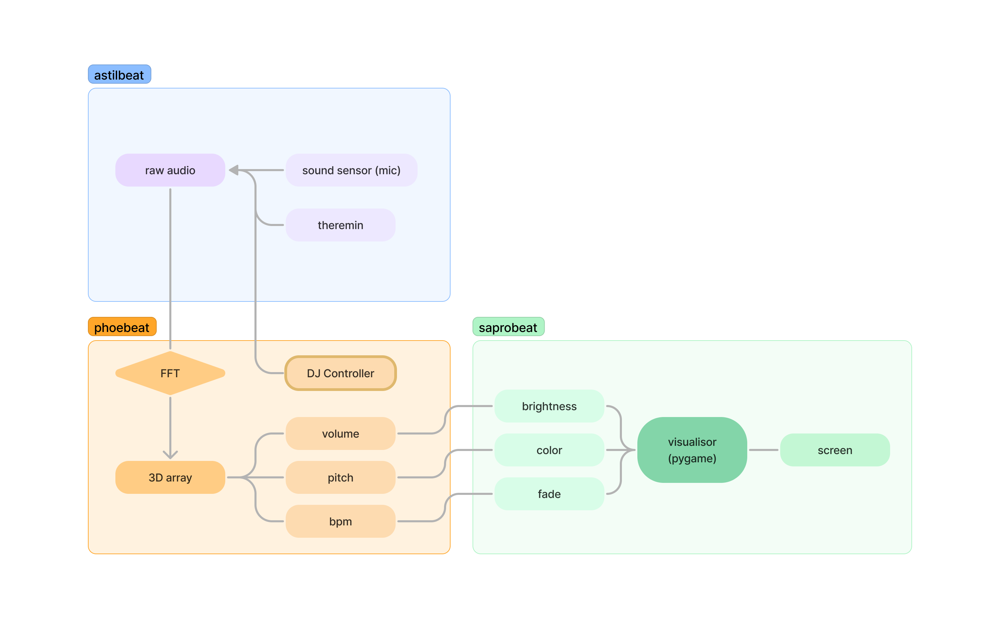
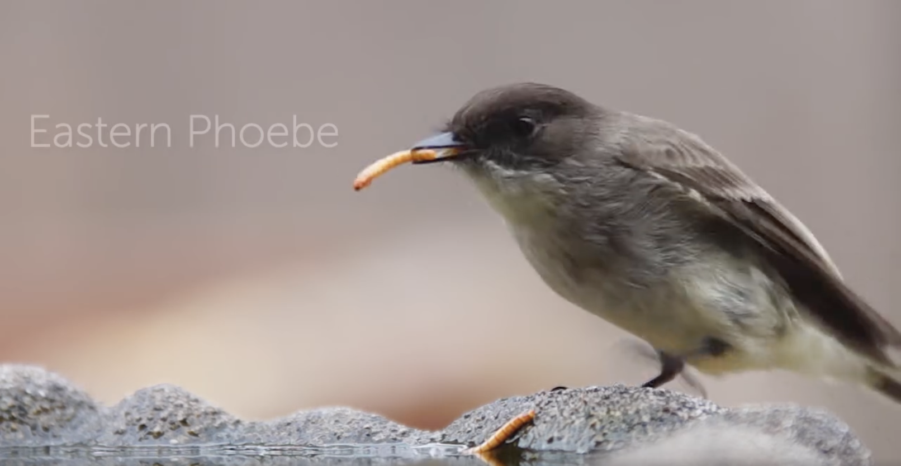
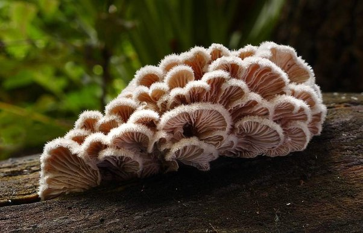

# microbeat
```
                           |\   
                           | \  
                           |  \ 
                           |   )
                           |  / 
                          _|.'  
       __               .' |         
   _  |@@|             /   |_.  
  / \ \--/ __         |  .'|  '.
  ) O|----|  |   __    \ * |   /
 / / \ }{ /\ )_ / _\    '._|_.' 
 )/  /\__/\ \__O (__       |    
|/  (--/\--)    \__/     * |    
/   _)(  )(_             '.'    
   `---''---`
```

## Structure
### Original Design


### Final Design


## Funny Names
- microbeat = microbe + beat (also doubled as microcontroller beat)
- **audio -> visual:** phoebeat = phoebe flycatcher + beat

- **visualisor:** saprobeat (saprobe := decomposer subtype fungi)

- **audio input:** astilbeat (astilbe := plant w/ tiny white, pink, or red flowers)


## Usage
- **Accessibility -** Make music accessible to people with low musicality or hearing loss
- Present music visually breaking down to different dimensions, helpful for:
	- **Comparative Analysis -** comparing music genres (subgenres), historical periods, instruments, and performances visually
	- **Music History Timeline -** interactive timeline to explore the development of music over time, aiding in studying music history.
	- **Cross-Art Connections -** creating connections among different art styles (Ella's both photographer and DJ)
- Well U need to party before & after or even during studying XD


## What we learnt
- C++
- how to flash from ARM chip mac to arduino
- ncurses
- passing serial signal via UART

## Log
*Starting time: 2024-04-05 7.30pm*
- Brainstorm & Init structure set up 					- *1h in*

### Ella (saprobeat & phoebeat)
- Cpp compile & flash onto uno using platformio (pio) 	- *8h in*
- Midi -> 4D array										- *9h in*
- Live BPM detect										- *15h in*
- Set up MIDI circuit									- ABANDONED
- All above features tested								- ABANDONED, MIDI SUCKS
- MENTAL BREAKDOWN										- *16h-22h in*
- screen visualisor draft (python)						- *23h in*
- ncurses attempt (visualisor in terminal)				- *24h in*
- refined visualisor (screen)							- *25h in*
- update r, g, b, delay & fade while displaying			- *28h in*
- merged saprobeat into main 							- *28h in*
- FFT to extract BPM, volume & pitch from raw audio 	- *31h in* (code compiled)
- Cpp & python binding									- *38h in*
- python animation design/ update formulas				- *42h in*
- Decide sampling rate, num samples						- *42h in*
- paddings? (using analogReadResolution())				- WONT FIX
- Presentation prep
	- 5min DJ set
	- Easter egg for vry loud


### Jack (astilbeat)
- Get audio input
- Get analog audio onto arduino, can't use USB for this **REMEMBER ADJUST VOLTAGE TO POSSITIVE - negative voltage would demage the Arduino**
- Presentation prep
	- explain how it works using theramin?

## Known issues/ concerns
- passing 4D array (channel, duration, volume, pitch) might introduce competing issue [multi threads]
- We might want seperate midis for music & environment - BPM read off env would be noisy
- imagine a song without drums (detecting BPM)
- sound sensor 1 bit & not accurate

## Special thx to
- everyone who offered helps
- Suppliers of hardwares (arduino, sound sensors) tha may or may not be present


